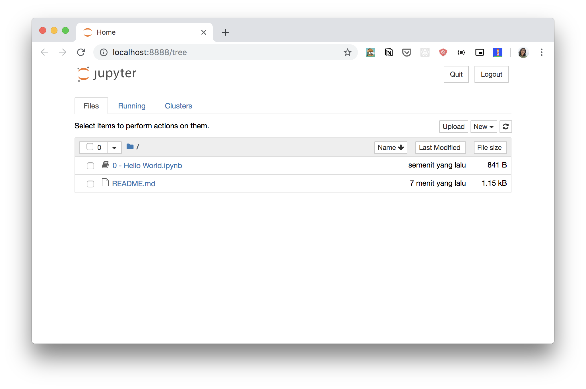

# Learn Jupyter

This repository contains notebooks to getting started and familiar with [Jupyter Notebook](https://jupyter.readthedocs.io/en/latest/index.html).

## Prerequisites

- Install Git -- [see here](https://help.github.com/en/articles/set-up-git).
- Install Python, preferably Python 3 -- [see here](https://www.python.org/downloads/).
- Install Jupyter, preferably using Pip -- [see here](https://jupyter.org/install).

## Getting Started

Clone this repository:

```bash
git clone https://github.com/airlab-unsri/learn-jupyter.git
```

Go to the newly created directory:

```bash
cd learn-jupyter
```

Run Jupyter server:

```bash
jupyter notebook
```

You will see these logs about notebook server on your terminal:

```bash
[I 19:35:22.651 NotebookApp] Serving notebooks from local directory: /Users/ariefrahmansyah/go/src/github.com/airlab-unsri/learn-jupyter
[I 19:35:22.652 NotebookApp] The Jupyter Notebook is running at:
[I 19:35:22.652 NotebookApp] http://localhost:8888/?token=a4b07370141c91fd96fa5d563ac1c680322d7369ce70064d
[I 19:35:22.652 NotebookApp] Use Control-C to stop this server and shut down all kernels (twice to skip confirmation).
```

It will then open your browser:


